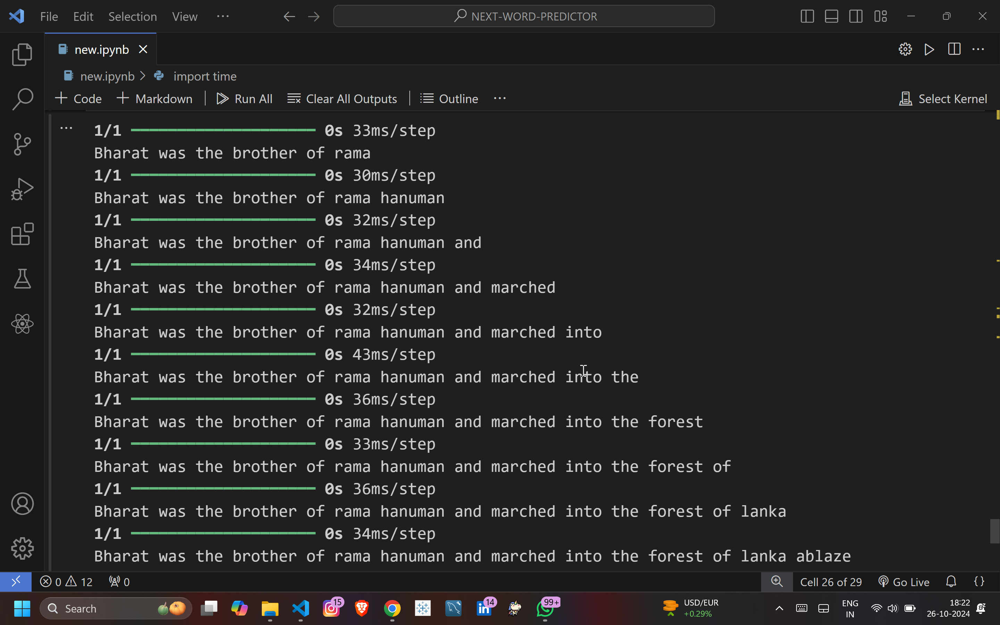

<!DOCTYPE html>
<html lang="en">
<head>
    <meta charset="UTF-8">
    <meta name="viewport" content="width=device-width, initial-scale=1.0">
    <title>Next Word Predictor</title>
    
</head>
<body>
    

        <h1>Next Word Predictor</h1>
        
         

            This project aims to create a machine learning model that predicts the next word in a sequence based on randomly selected text data from the internet. The goal is to generate a text completion tool that can be integrated into various applications, such as chatbots, writing assistants, or educational tools.
        

        <h2>Project Overview</h2>
        

            The Next Word Predictor leverages natural language processing (NLP) techniques to analyze a given sequence of text and suggest the most likely next word. The model is trained on diverse datasets obtained from internet sources, allowing it to understand a wide range of language patterns and contexts.
        

         <h3>Key Features</h3>
        <ul>
            <li><strong>Real-Time Prediction:</strong> Provides word suggestions based on the preceding text input.</li>
            <li><strong>Contextual Understanding:</strong> Learns from large datasets to understand the context in which words are used.</li>
            <li><strong>Adaptable:</strong> Can be trained and fine-tuned on different datasets to cater to specific domains or applications.</li>
        </ul>

        <h2>How It Works</h2>
        <ol>
            <li><strong>Data Collection:</strong> Text data is randomly collected from various internet sources. The data is preprocessed to clean and standardize the text.</li>
            <li><strong>Model Training:</strong> The cleaned text is used to train a machine learning model. Models like Recurrent Neural Networks (RNN), Long Short-Term Memory (LSTM) networks, or Transformer architectures (e.g., GPT) may be used to predict the next word in a sequence.</li>
            <li><strong>Prediction:</strong> Once trained, the model takes a text input and predicts the most likely next word based on the patterns it has learned.</li>
            <li><strong>Fine-Tuning (Optional):</strong> The model can be fine-tuned to improve accuracy on specific types of text or applications.</li>
        </ol>

        <h2>Screenshots</h2>
        

            
            
Screenshot 1: Model training process in action

        

        

            
            
Screenshot 2: Example of text prediction using the trained model

        

        

            
            
Screenshot 2: Example of text prediction using the trained model

        

        
    

</body>
</html>
